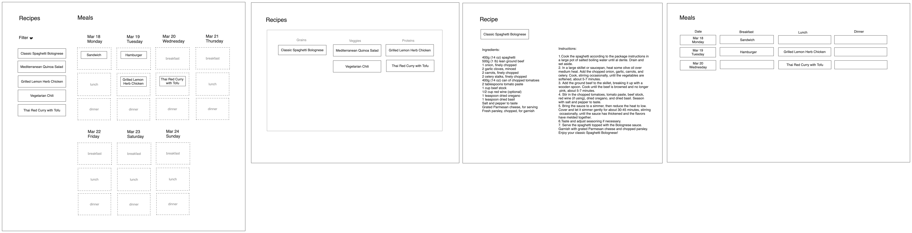

# Project Title

EasyMealMap

## Overview

EasyMealMap is a meal planning tool designed to streamline your meal planning routine and get personalized recommendations.

### Problem

It is needed to address the common challenges and frustrations people face when planning meals. Many individuals struggle with finding inspiration for meals, managing their time effectively, and accommodating various dietary preferences. EasyMealMap solves these problems by providing a user-friendly interface that offers a wide range of recipes, meal ideas, and customization options.

### User Profile

- People who plan for their cooking:
  - Getting recommendations based on their preferences
  - Keeping track of their meals
  - Customize meal plans

### Features

- As a user, I want to be able to get a plan based on my preferences or recommendations
- As a user, I want to be able to change my meal plans
- As a user, I want to be able to keep track of my meals
- As a user, I want to be able to check out recipes (by category)
- As a user, I want to be able to check out recipe details

## Implementation

### Tech Stack

- React
- SASS
- MySQL
- Express
- Client libraries
  - react-router
  - axios
  - React-beautiful-dnd
- Server libraries:
  - knex
  - express

### APIs

- No external APIs will be used for the first sprint

### Sitemap

- Home page

### Mockups

### Data

https://drawsql.app/teams/pen-3/diagrams/easymealmap

### Endpoints

**GET /recipes**
**GET /recipes/:id**

**GET /meals**
**GET /meals/auto**
**DELETE /meals?meal_id&recipe_id**
**POST /meals**
**GET /meals/id/:id**
**PUT /meals/id/:id**

### Auth

N/A

## Roadmap

- Create repos and git setup

  - front-end: create-react-app
  - back-end

- Research API for recipes

- Database setup

  - Retrieve recipes and clean sample data from API as seeds
  - Create a new project and Configure Knex.js
  - Create Tables
  - Seeding Data
  - Querying Data

- Research

  - Drag and Drop library

- Create client

  - react project with routes and boilerplate pages

- Create server

  - express project with routing, with placeholder 200 responses

- Create endpoints for back-end

- Feature: Meals

  - Get Meal list for this week
  - Edit Meal list
  - Delete recipe

- Feature: Auto generation

## Nice-to-haves

- Sync with External data
  - Notion
  - Import
- Add recipe
- Change recipe
- Recipe detail
- Customize meals per day
- Search recipe
- Auto save
- Auto generation rules
- Regenerate a specific meal
- Regenerate for a specific meal
- Auth
- Add/Edit recipes
